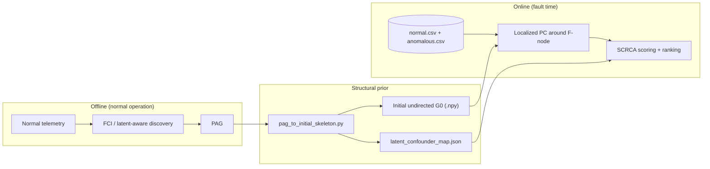

This repository implements the **Structural Causal Root Cause Analysis (SCRCA)** framework.

---

## Environment setup

### Python environment

Use a dedicated **virtual environment** so dependency versions stay isolated from the system interpreter. **Python 3.8** matches the layout assumed below (e.g. `~/env/lib/python3.8/site-packages`); a newer 3.x release is fine if you adjust paths accordingly.

Install the two main libraries this project calls from PyPI: **causal-learn**, **pyAgrum**, plus **numpy**, **pandas**, **networkx**, **scikit-learn**, **scipy**, **matplotlib**, and anything else your workflow needs. Pin versions to match your experiments if required.

```bash
python3.8 -m venv env
source env/bin/activate    # Windows: env\Scripts\activate
python3 -m pip install --upgrade pip
# pip install causal-learn pyAgrum numpy pandas networkx scikit-learn scipy matplotlib ...
```

### pyAgrum and causal-learn

Standard installs from PyPI are **not sufficient** on their own: SCRCA relies on **modified copies** of several modules shipped in this repository under `pyAgrum/` and `causallearn/` (e.g. extra reporting, localized skeleton behaviour for PC, and small bug fixes). After `pip install`, you should **replace** the corresponding files inside the venv with symlinks to these repo versions so imports resolve to the patched code.

```bash
# Adjust paths to your clone and venv site-packages
SCRCA_REPO=~/Documents/Waterloo/SCRCA
SITE=~/env/lib/python3.8/site-packages

ln -fs "$SCRCA_REPO/pyAgrum/lib/image.py"           "$SITE/pyAgrum/lib/"
ln -fs "$SCRCA_REPO/causallearn/search/ConstraintBased/FCI.py"  "$SITE/causallearn/search/ConstraintBased/"
ln -fs "$SCRCA_REPO/causallearn/utils/Fas.py"       "$SITE/causallearn/utils/"
ln -fs "$SCRCA_REPO/causallearn/utils/PCUtils/SkeletonDiscovery.py"  "$SITE/causallearn/utils/PCUtils/"
ln -fs "$SCRCA_REPO/causallearn/graph/GraphClass.py"  "$SITE/causallearn/graph/"
```

Symlink targets are **absolute**. If you **rename or move** the repository, old links keep pointing at the previous path and imports can break; re-run the `ln -fs` commands with the updated `SCRCA_REPO`.

### System packages (Debian/Ubuntu)

For building or running some native dependencies, you may need development headers and tools:

```bash
sudo apt update
sudo apt install -y build-essential python3-dev python3-venv python3-pip \
  libxml2 libxml2-dev zlib1g-dev python3-tk graphviz
```

---

## End-to-end pipeline (offline → online)



1. **Offline:** Run **FCI** (or another PAG-producing method) on **normal-operation** data only; obtain a **PAG** (`GeneralGraph` in causal-learn, or equivalent).
2. **Prior:** Use **`pag_to_initial_skeleton.py`** on the PAG (rules below): build **`initial_pc_skeleton_adj`** and save e.g. `initial_pc_skeleton.npy` for fault-time PC, and optionally emit **`latent_confounder_map.json`** from **bidirected** PAG edges (`X <-> Y`, arrowhead–arrowhead in causal-learn) so SCRCA latent scoring can reuse the same offline graph.
3. **Online:** **`run_rca_case`** in **SCRCA.py** loads fault-time **`normal.csv` / `anomalous.csv`**, optionally drops “hidden” metrics, runs multi-phase **fault-time PC causal discovery** with that initial skeleton, then computes **observed + latent** scores and a final candidate ranking.

---

## Key files

| File / directory | Role |
|------------------|------|
| **`SCRCA.py`** | Main entry for one case: loads data, optional column hiding, runs **`rca_with_rcd`** (multi-phase fault-time PC causal discovery: chunked localized PC plus a final scored pass), computes **SCRCA** observed/latent scores and ranking. |
| **`utils.py`** | **`top_k_rc`**: multi-α PC loop; **`run_pc`**: localized or global skeleton discovery; F-node preprocessing; optional **`initial_skeleton_adj`**; CI test counting; **Pa(F)** / **p_min** extraction when `return_scores=True`. |
| **`pag_to_initial_skeleton.py`** | Converts an offline **PAG** into **`initial_pc_skeleton_adj`** (undirected **G₀** for PC initialization) and can derive a **`latent_confounder_map`** JSON from **bidirected** edges among observed nodes (see section below). |
| **`causallearn/...`** | Vendored/patched **causal-learn** pieces (**FCI**, **SkeletonDiscovery**, **GraphClass**, **Fas**) — keep in sync with venv symlinks. |
| **`pyAgrum/`** | Patched **pyAgrum** helper(s). 

---

## Offline phase: FCI → PAG

- Use **causal-learn** (patched **FCI** in this repo) on a DataFrame or array of **normal-operation** samples only (no fault label).
- Output is a **PAG** represented as a **`GeneralGraph`** (nodes = measured variable names consistent with your telemetry columns).
- The PAG encodes **Markov equivalence** under latent confounding: orientations and circle marks reflect what is identifiable from conditional independences.

**Inputs:** normal-operation matrix, independence test and α, optional background knowledge.  
**Outputs:** graph object with PAG edge marks (tails, arrows, circles, bidirected).

---

## PAG → initial graph (`pag_to_initial_skeleton.py`)

**Purpose:** Build the **starting undirected skeleton** for fault-time PC, **not** a copy of the PAG. Only some PAG edges become adjacencies in **G₀**:

- If a PAG edge has **at least one tail** endpoint (including undirected `--`, directed segments with a tail, tail–circle, etc.), it becomes an **undirected** adjacency in **G₀** (possible direct causal link under the paper’s mapping).
- **Bidirected** (`<->`), **circle–circle** (`o-o`), and **partially directed** (`o->`, `<-o`) edges **do not** add that adjacency in **G₀** (latent confounding or insufficient evidence for a direct link in the initialization).
- Pairs **non-adjacent** in the PAG stay **non-adjacent** in **G₀**.

**Fault node `F-node`:** If **F** is **not** a node in the offline PAG (typical), default behavior **`connect_f_to_all_observed=True`** adds a **star** connecting **F** to every observed variable in **`node_order`** so localized PC can still run. If **F** is in the PAG, **F**’s edges come only from the PAG.

**Latent map from the same PAG (bidirected edges):** Independently of **G₀**, a **bidirected** edge between two **observed** PAG nodes (**`X <-> Y`**, i.e. **arrowhead at both endpoints** in causal-learn’s adjacency) is treated as evidence that those two metrics may share a **latent confounder**. The module can turn each such pair into one SCRCA map entry **`"L_X_Y" → ["X", "Y"]`** (names sorted for stable keys). Pairs that involve **`F-node`** are skipped. This is orthogonal to the **G₀** rule above: bidirected edges **do not** become **G₀** adjacencies, but they **do** feed the optional latent JSON. You can:

- pass **`write_latent_map_path=".../latent_confounder_map.json"`** into **`pag_to_initial_skeleton_adj`** (written when the skeleton is built), or  
- call **`pag_latent_confounder_map(graph, f_node=..., key_prefix="L")`** and **`save_latent_confounder_map(path, map)`** on their own.

**Main API**

- `pag_to_initial_skeleton_adj(..., write_latent_map_path=None, latent_map_key_prefix="L") → ndarray` — same skeleton arguments as before; if **`write_latent_map_path`** is set, also writes the JSON latent map.
- `pag_latent_confounder_map(graph, f_node="F-node", key_prefix="L") → dict`
- `save_latent_confounder_map(path, map)` — UTF-8 JSON on disk
- `save_initial_skeleton(path, adj)` — e.g. `np.save` to **`data/.../initial_pc_skeleton.npy`**

**Inputs**

- `graph`: `GeneralGraph` or object with `.G` (e.g. causal-learn graph wrapper).
- `node_order`: list of names, same order as fault-time data columns **plus** **`F-node` last** (must match **`utils.F_NODE`** / `'F-node'`).

**Output:** symmetric float matrix **`(n, n)`**, nonzeros (usually `1.0`) where **G₀** has an edge; diagonal typically `1.0` to match dense initialization files used with SCRCA. Optional sidecar: **`latent_confounder_map.json`** as above.

---

## Online phase: `SCRCA.py`

**Purpose:** Given fault-time **normal** and **anomalous** batches, run **fault-time PC causal discovery** (PC on normal vs anomalous batches with a dedicated fault node **F**) with an optional **informed initial skeleton**, then rank **observed** and **latent** root-cause candidates using **p_min**-based scores and a latent promotion factor **α**.

### Main entry: `run_rca_case`

| Argument | Meaning |
|----------|---------|
| `data_dir` | Directory containing **`normal.csv`** and **`anomalous.csv`**. |
| `latent_confounder_map` | Dict **`"L_name" → [proxy column names]`** (often from **`latent_confounder_map.json`** produced with **`pag_to_initial_skeleton.py`**). Used only for **latent** scores. |
| `k` | If not `None`, truncate ranked root causes to top-**k** (wrapper `top_k_rc`). |
| `bins` | Discretization bin count for **`utils`** preprocessing; `None` keeps continuous (subject to test). |
| `gamma` | Chunk size for phase-1 subsetting. |
| `seed` | RNG seed (chunk permutations, etc.). |
| `localized` | Use **localized** skeleton discovery around **F** (`True` is the usual setting for fault-time PC around the fault). |
| `verbose` | Print progress. |
| `dropped_root_cause_idx` | `None`, an **int**, or **iterable of ints**: column indices to drop from both dataframes (simulate unmonitored metrics). |
| `latent_alpha` | **α** in **`s(L) = α × Σ s(X)`** over proxies that are also parents of **F**. |
| `initial_pc_skeleton_adj` | Optional **`(n_obs+1)²`** array: variable order **`[*df.columns, F-node]`**; `None` = fully connected start. Can **`np.load`** from disk. |

**Returns** (dict): timing, CI test count, **`parents_of_fault`**, **`pmin_by_node`**, observed/latent scores, ranking, hidden-column metadata, etc.

### Internal flow (short)

1. Load CSVs; optionally drop hidden columns.
2. **`rca_with_rcd`** (fault-time PC pipeline): phase 1 repeatedly chunks variables and calls **`utils.top_k_rc`**; phase 2 calls **`top_k_rc(..., return_scores=True)`** on the surviving set to get **Pa(F)** and **p_min** per variable.
3. **Observed score:** **`s(X) = -log p_min(X,F)`** if **X** is a parent of **F**, else **0**.
4. **Latent score:** for each latent **`L`**, **`Proxies_F(L) = proxies(L) ∩ Pa(F)`**, then **`s(L) = latent_alpha × Σ_{X ∈ Proxies_F(L)} s(X)`**.
5. Merge and sort all candidates by score.

---

## Data layout

- **`normal.csv`**, **`anomalous.csv`**: rows = samples, columns = metric names (no **F-node** column; **F** is injected in **`utils.add_fnode`**).
- **`initial_pc_skeleton.npy`**: must match **column order after** any column drops, with **F** as the **last** index.
- **`latent_confounder_map.json`** (optional): object mapping latent labels to lists of observed column names used as proxies in SCRCA scoring, e.g. `{ "L_a_b": ["a", "b"] }`. Author by hand or generate from the PAG as described in **PAG → initial graph** (bidirected edges → one entry per pair).

---


